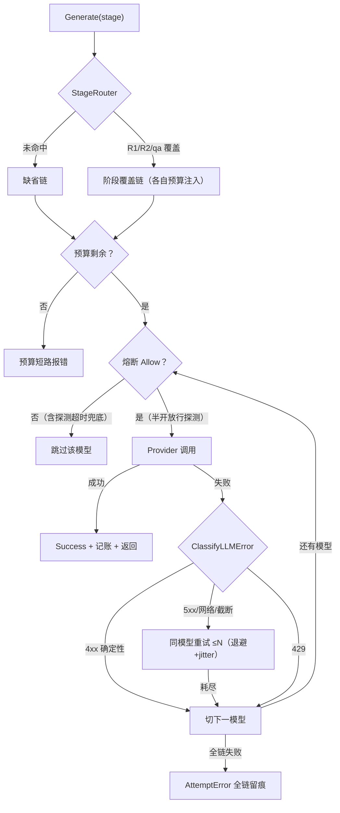
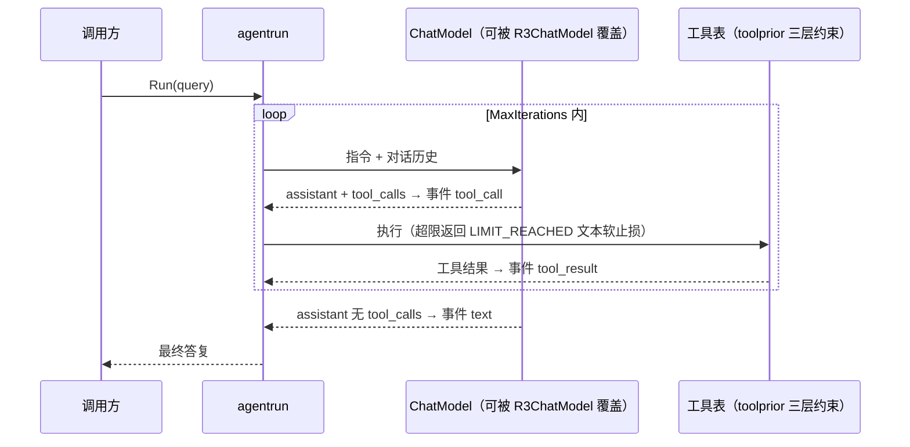
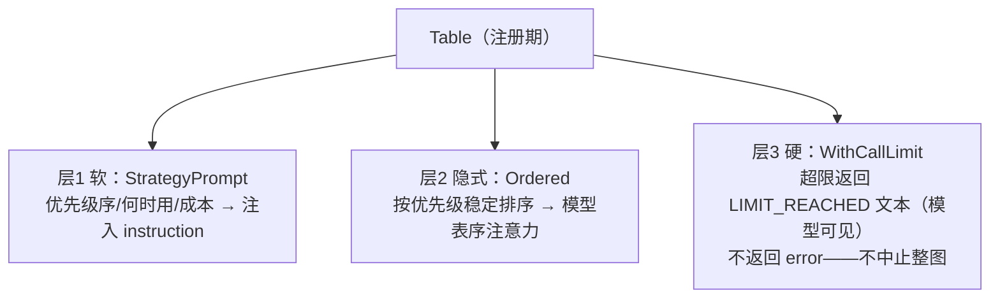
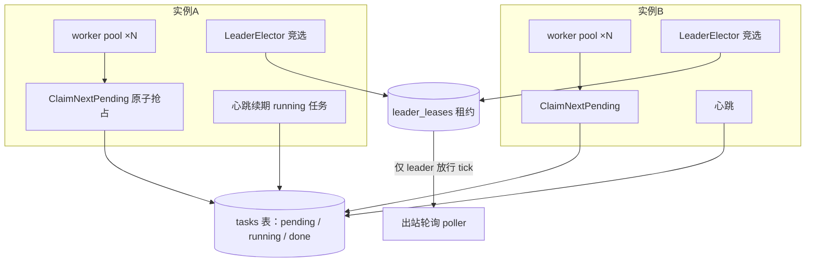
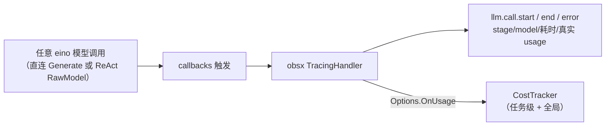
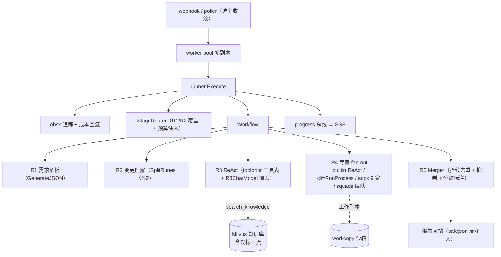

# agentkit 框架完整文档

> 版本：v0.8.1 · Go ≥ 1.25 · 模块路径 `git.enjoye.top/enjoydream/agentkit`
> 配套文档：[架构模式支持矩阵](patterns.md)（七架构何时用/何时不用）· [README](../README.md)（快速上手）

> 文中架构图使用 Mermaid：Forgejo/GitHub 等端原生渲染；不支持渲染的查看端，
> 代码块本身仍按文本可读。

---

## 目录

1. [框架定位与设计原则](#一框架定位与设计原则)
2. [总体架构与包清单](#二总体架构与包清单)
3. [L1 模型层 —— llm](#三l1-模型层--llm)
4. [L2 编排层 —— agentrun / reflection / router / blackboard](#四l2-编排层--agentrun--reflection--router--blackboard)
5. [L3 决策层 —— toolprior / skill](#五l3-决策层--toolprior--skill)
6. [L4 工具与上下文层 —— acpx / mcp / workcopy / knowledge/rag / textutil](#六l4-工具与上下文层)
7. [L5 运行时基础设施 —— breaker / worker / progress / safejson / severity / audit](#七l5-运行时基础设施)
8. [L6 可观测层 —— obsx](#八l6-可观测层--obsx)
9. [七架构模式支持](#九七架构模式支持)
10. [横向能力专题](#十横向能力专题)
11. [生产实践：Argus 参考实现](#十一生产实践argus-参考实现)
12. [版本纪律与陷阱清单](#十二版本纪律与陷阱清单)

---

## 一、框架定位与设计原则

**agentkit 是从生产代码审查平台（Argus）提炼的 AI Agent 开发工具箱**：一组可在
LLM 应用之间共享的 Go 组件，覆盖模型调用、编排样板、工具治理、知识检索、运行时
基础设施与可观测。

### 设计原则

| 原则 | 含义 |
|---|---|
| **不重复 eino** | 编排原语（图/顺序/并行/循环/Supervisor）由底座 eino 提供；agentkit 提供**原语之上的样板与领域件**——降级链、工具纪律、限流、知识。节点内用 agentkit 样板，节点间用 eino 编排 |
| **样板沉淀** | 凡是生产中复制过两次的胶水代码（ADK 构造/事件 drain/出口判定/进程组纪律/租约选主），提炼成包——消费方一行调用 |
| **生产纪律内建** | 重试/限速/预算/超时/降级/熔断/审计不是可选项，是组件默认行为；失败路径与成功路径同等对待 |
| **失败可见** | 有损设计必须可观测（progress.Dropped）、状态机边界必须有兜底（熔断探测超时）、文档承诺必须等于实现行为 |
| **从简单开始** | 架构选型从 Single Agent 起步，被现实逼着升级；七种架构的支持矩阵见 patterns.md |

### 不是什么

- 不是 LangChain 式的全家桶链式 DSL——编排交给 eino；
- 不是模型代理/网关——模型调用经 eino-ext 各 provider SDK 直连；
- 不绑定特定 LLM 供应商——一切经 eino `model.BaseChatModel` / `ToolCallingChatModel`
  抽象，OpenAI/百炼/DeepSeek 等任何兼容端点均可。

---

## 二、总体架构与包清单

```
┌──────────────────────────────────────────────────────────────┐
│ L2 编排层  agentrun(ReAct/P&E)  reflection  router  blackboard │
├──────────────────────────────────────────────────────────────┤
│ L3 决策层  toolprior(工具优先级/限流)    skill(渐进披露)         │
├──────────────────────────────────────────────────────────────┤
│ L1 模型层  llm(Client/Resilient 降级链/Budget/StageRouter/成本)  │
├──────────────────────────────────────────────────────────────┤
│ L4 工具与上下文  acpx(9家CLI agent)  mcp(工具池)  workcopy(副本) │
│                 knowledge/rag(双后端检索)  textutil             │
├──────────────────────────────────────────────────────────────┤
│ L5 运行时  breaker(熔断)  worker(队列+选主)  progress(总线)      │
│            safejson(反注入) severity(归一/指纹) audit(审计)      │
├──────────────────────────────────────────────────────────────┤
│ L6 可观测  obsx(eino callbacks 追踪/真实 usage 回流)             │
└──────────────────────────────────────────────────────────────┘
        底座：eino v0.9.18 · eino-ext · mcp-go · milvus-sdk-go · ekit
```

| 包 | 职责 | 外部依赖 | 版本引入 |
|---|---|---|---|
| `llm` | LLM 客户端：重试/限速/预算/fitInput/JSON + Resilient 降级链 + StageRouter | eino, eino-ext openai, x/time | v0.1.0（v0.2 降级链，v0.8.1 路由） |
| `agentrun` | ReAct 运行样板 + Plan-and-Execute 样板（ADK 封装） | eino adk | v0.6.0（v0.8.0 P&E） |
| `toolprior` | 工具优先级决策层：提示词/排序/限流三层约束 | eino | v0.5.2 |
| `skill` | SKILL.md 解析 + 决策使用（渐进披露） | eino（仅 decision 部分） | v0.5.1 |
| `reflection` | 反思循环：生成→批判→修订收敛 | eino | v0.8.0 |
| `router` | LLM 意图路由：分类→选路→分发 | eino | v0.8.0 |
| `blackboard` | 共享黑板 + 专家轮转 | 无 | v0.8.0 |
| `acpx` | 9 家 CLI 编码 agent 统一调用 + RunProcess 进程托管 | eino | v0.1.0 后（v0.7.1 导出 RunProcess） |
| `mcp` | MCP server 工具池（lazy 建连/env 白名单/工具白名单） | eino, eino-ext tool/mcp, mcp-go | v0.5.0 |
| `workcopy` | Git 工作副本沙箱（singleflight + 引用计数 + TTL） | ekit, x/sync | v0.1.0 |
| `knowledge/rag` | 双后端 RAG：Local TF-IDF + Milvus 向量 | eino, milvus-sdk-go | v0.1.0 |
| `breaker` | 熔断器（closed→open→half-open，探测超时兜底） | 无 | v0.1.0 |
| `worker` | DB 即队列 worker pool + LeaderElector 选主 | ekit | v0.1.0（v0.7.3 选主） |
| `progress` | 泛型事件总线（有损广播 + 丢弃计数） | ekit | v0.1.0 |
| `obsx` | eino callbacks 追踪（结构化日志 + 真实 usage 回流） | eino, ekit | v0.4.0 |
| `safejson` | Markdown/HTML 反注入 | 无 | v0.1.0 |
| `severity` | 严重级别归一化 + SHA256 指纹 + glob | 无 | v0.1.0 |
| `audit` | 审计日志 | ekit | v0.1.0 |
| `textutil` | rune 安全截断/等分块 | 无 | v0.1.0 |

---

## 三、L1 模型层 —— llm

一切 LLM 调用的入口。两代客户端实现同一 `Generator` 接口，可无感互换：

```go
type Generator interface {
    Generate(ctx context.Context, stage string, msgs []*schema.Message) (*schema.Message, error)
    GenerateJSON(ctx context.Context, stage string, msgs []*schema.Message, out any) error
    UsedTokens() int
    RawModel() model.BaseChatModel
}
```

`stage` 不是装饰：它随 ctx 注入（obsx 追踪读取）、驱动退避策略、并作为 StageRouter 的路由键。

### Client —— 单模型客户端

```go
client := llm.NewClient(chatModel, "deepseek-v4", budget) // budget: TokenAccountant，可 nil
client.ContextTokens = 1_000_000      // 模型窗口；驱动 fitInput 自守恒
client.MaxOutputTokens = 50_000       // 输出预留
client.Limiter = rate.NewLimiter(10, 20) // 可选全局限速
client.OnUsage = func(stage string, p, c int) { /* Prometheus/记账 */ }

msg, err := client.Generate(ctx, "R1", msgs)            // 重试（指数退避+jitter，429 下限 5s）
err = client.GenerateJSON(ctx, "R3", msgs, &spec)       // 解析失败带错误回喂重试 1 次
```

内建行为：

- **fitInput 自守恒**：输入超 `(窗口-输出预留)×2×0.9` 时截断最长 user 消息并留痕；不污染调用方切片。
- **截断防护**：`finish_reason=length` 转为错误返回（带 completion_tokens）；`MaxOutputTokens>0` 时截断重试自动提升 max_tokens ×1.5。
- **错误分类**：`ClassifyLLMError` —— 结构化状态码优先（go-openai RequestError），文本兜底带数字词边界（"429" 不误命中 "1429ms"）；4xx 确定性失败（400/401/404/422…）不重试，5xx/网络错误重试，429 提高退避下限。
- **兼容开关**：`MaxOutputTokens < 0` = 不下发 `max_tokens` 参数（要求 `max_completion_tokens` 的推理模型）。

### Resilient —— 多模型降级链

```go
primary, _  := llm.NewOpenAIProvider(ctx, llm.OpenAIProviderConfig{
    BaseURL: "...", APIKey: "...", Model: "main", ContextTokens: 1_000_000})
fallback, _ := llm.NewOpenAIProvider(ctx, llm.OpenAIProviderConfig{...Model: "backup"...})

r := llm.NewResilient(llm.NewFallbackChain(primary, fallback), llm.ResilientConfig{
    RetriesPerModel: 2,
    Limiter: limiter,                     // 共享限速
    Tracker: llm.NewCostTracker(),        // 可选：内置成本记账（费率来自 Provider 配置）
    OnUsage: func(model, stage string, p, c int) {...},
    OnFallback: func(from, to, stage, reason string) {...},
})
msg, attempts, err := r.GenerateWithTrace(ctx, "R1", msgs) // attempts 留痕每次尝试
```

**降级决策矩阵**（有测试锁定）：

| 错误 | 同模型重试 | 切下一模型 |
|---|---|---|
| 429 | ❌（立即切） | ✅ |
| 401/403/上下文超限/其余 4xx | ❌ | ✅ |
| 5xx / 网络错误 | ✅（≤RetriesPerModel） | ✅ |
| 输出截断 | ✅（max_tokens ×1.5） | ✅ |

- 每模型独立熔断（Breakers）；全部模型熔断时报"全部 N 个模型均处于熔断冷却中"；
- 预算耗尽全链短路（入口 + 逐 provider 复查）；
- 半开探测有 `DefaultProbeTimeout` 超时兜底——探测失联不会永久逐出模型；
- `AttemptError` 全链失败留痕每次尝试（Provider/Model/Err/Duration）。


```mermaid
flowchart TD
    REQ["Generate(stage)"] --> SR{"StageRouter"}
    SR -- "未命中" --> GEN["缺省链"]
    SR -- "R1/R2/qa 覆盖" --> SGEN["阶段覆盖链（各自预算注入）"]
    GEN --> BUD{"预算剩余？"}
    SGEN --> BUD
    BUD -- "否" --> SHORT["预算短路报错"]
    BUD -- "是" --> ALLOW{"熔断 Allow？"}
    ALLOW -- "否（含探测超时兜底）" --> SKIP["跳过该模型"]
    ALLOW -- "是（半开放行探测）" --> TRY["Provider 调用"]
    TRY -- "成功" --> OK["Success + 记账 + 返回"]
    TRY -- "失败" --> CLS{"ClassifyLLMError"}
    CLS -- "4xx 确定性" --> SWITCH["切下一模型"]
    CLS -- "5xx/网络/截断" --> RETRY["同模型重试 ≤N（退避+jitter）"]
    RETRY -- "耗尽" --> SWITCH
    CLS -- "429" --> SWITCH
    SWITCH -- "还有模型" --> ALLOW
    SWITCH -- "全链失败" --> ATT["AttemptError 全链留痕"]
```

### Budget —— 任务级预算

```go
budget := llm.NewBudget(600_000) // TokenAccountant 标准实现
budget.Remaining() / Used() / Add(n)
```

传给 `NewClient` 第三参，或经 `BudgetInjector` 注入已有链：

```go
if bi, ok := gen.(llm.BudgetInjector); ok {
    gen = bi.WithBudget(budget) // Resilient 显式副本（共享熔断状态）；Client 浅拷贝
}
```

### StageRouter —— 分阶段模型路由（v0.8.1）

```go
sr := llm.NewStageRouter(defaultGen)  // 缺省 = 主链（含预算注入）
sr.Use("R1", bigWindowGen)            // 前缀路由："R1" 命中 "R1a"
sr.Use("qa", fastGen)                 // 精确路由
// 调用点不变：sr.Generate(ctx, "R1a", msgs) 自动走 bigWindowGen
```

精确命中优先、最长前缀其次、未命中走缺省链；`UsedTokens` 聚合全部链；
预算注入由调用方在注册前完成（`BudgetInjector.WithBudget`）。

### CostTracker —— 成本记账

```go
ct := llm.NewCostTracker()
ct.Record(model, stage, promptTokens, completionTokens, [2]float64{prompt费率, completion费率})
ct.Summary() // map[model]ModelSummary{TotalTokens, TotalCostUSD, CallCount}
```

上限 10_000 条（防长驻进程无界增长）。注意：`llm.Client.OnUsage` 只覆盖 Generate
路径；ReAct（RawModel 直用）路径的真实 usage 经 `obsx.Options.OnUsage` 回流（见 obsx）。

### 其他 API

- `ExtractJSON(s)`：从模型输出剥围栏/截取首个 JSON 对象或数组；
- `IsRateLimitError` / `IsTruncatedError` / `RetryableLLMError`：错误分类快速判定。

---

## 四、L2 编排层 —— agentrun / reflection / router / blackboard

### agentrun —— ReAct 运行样板

封装 eino ADK 的 ChatModelAgent + Runner：构造、事件流 drain、出口判定
（assistant 无 tool_calls 即最终答复）、重试样板。

```go
out, err := agentrun.RunWithEvents(ctx, agentrun.Config{
    Name: "reviewer", Description: "审查专家",
    Instruction: instruction,
    Model: chatModel,                       // 或 RawModel()
    ToolsFactory: func() []tool.BaseTool {  // 每次尝试重建——WithCallLimit 计数按尝试重置
        return buildTools()
    },
    MaxIterations: 12,
}, query, func(e agentrun.Event) {
    // e.Type: text | tool_call | tool_result（工具轨迹可观测）
})
```

- `Run` / `RunWithEvents` / `RunWithRetry` / `RunWithEventsAndRetry` 四种入口；
- `Config.Tools`（静态表）与 `ToolsFactory`（按尝试重建）二选一，后者优先——
  **RunWithRetry + WithCallLimit 组合必须用 Factory**，否则限流计数跨尝试累计；
- MaxIterations 默认 12；迭代耗尽/空答复返回明确错误，无死循环；
- 失败语义：与 toolprior 软止损配合（超限返回 LIMIT_REACHED 文本而非 error，
  不会中止整图丢弃进展）。


```mermaid
sequenceDiagram
    participant C as 调用方
    participant A as agentrun
    participant M as ChatModel（可被 R3ChatModel 覆盖）
    participant T as 工具表（toolprior 三层约束）
    C->>A: Run(query)
    loop MaxIterations 内
        A->>M: 指令 + 对话历史
        M-->>A: assistant + tool_calls → 事件 tool_call
        A->>T: 执行（超限返回 LIMIT_REACHED 文本软止损）
        T-->>A: 工具结果 → 事件 tool_result
    end
    M-->>A: assistant 无 tool_calls → 事件 text
    A-->>C: 最终答复
```

### agentrun.PlanAndExecute —— 计划先行编排

```go
res, err := agentrun.PlanAndExecute(ctx, agentrun.PlanExecuteConfig{
    Planner:  plannerModel,  // 须支持 tool calling（计划结构以 ToolInfo 强制产出）
    Executor: executorModel,
    Tools:    tools,
    MaxSteps: 10,
    PlannerInstruction: "约束/背景（经输入整形注入，不覆盖格式提示词）",
}, goal)
```

封装 eino `adk/prebuilt/planexecute` 三件套：Planner 拆解 → Executor 带工具执行 →
Replanner 决定完成或修订，"执行-重规划"循环收敛。适用边界见 patterns.md。

### reflection —— 反思循环

```go
res, err := reflection.Refine(ctx, &reflection.Config{
    Model: chatModel, Task: "实现该需求的函数", Input: 素材,
    Rubric: "1. 处理空切片 2. 无 data race",   // 必填：全部价值在 Rubric 质量
    MaxIterations: 3,
})
// res.Output 末稿；res.Converged 是否过审；res.Rounds 每稿+批判留痕
```

生成 → Critic 结构化评审（`{pass, issues}`）→ 带全量 issues 修订 → 收敛或达上限。
防御：pass=true 仍带 issues 判不通过（不自洽评审不可信）。

### router —— 显式意图路由

```go
r, _ := router.New(&router.Config{
    Model: fastModel, // 分类用快模型
    Routes: []router.Route{
        {Name: "bug-fix", Description: "修代码类", Handle: fixChain},
        {Name: "explain", Description: "解释类", Handle: explainChain},
    },
    MinConfidence: 0.6,
    Fallback: func(ctx context.Context, input, reason string) (string, error) { ... },
})
d, out, _ := r.Do(ctx, userInput) // d.Route/d.Confidence/d.Reason 全可观测
```

与 skill 的分工：意图可枚举（≤10）用 router（一次分类调用，各类链任意编排）；
类别多/由文档承载/需看全文再定用 skill 隐式路由。可组合：router 粗分到域，域内 skill 细分。

### blackboard —— 无中心多专家协作

```go
board := blackboard.NewBoard()
board.Seed("material", 材料文本)
res, _ := blackboard.Convene(ctx, board, []blackboard.Specialist{
    {Name: "security", Act: func(ctx, b, since int64) (bool, error) {
        for _, e := range b.EntriesAfter(since) { /* 观察增量 */ }
        b.Write("security", "finding", "...")
        return true, nil
    }},
    {Name: "perf", Act: ...},
}, &blackboard.ConveneOptions{MaxRounds: 3})
```

线程安全 Board（单调 Seq + since 游标增量）；每轮各专家依次观察，**一整轮无人贡献
即共识停止**。与 Supervisor（中心指派）互斥选择；专家彼此独立时用并行 fan-out 更优。

---

## 五、L3 决策层 —— toolprior / skill

### toolprior —— 工具优先级三层约束

扁平工具表上叠加：① `StrategyPrompt`（提示词软约束：优先级序/何时用/成本）②
`Ordered`（表序注意力引导，Info 失败条目排末尾）③ `WithCallLimit`（硬限流：超限
返回模型可见的 `LIMIT_REACHED: ...` 文本软止损——**不返回 error**，避免 eino
ToolsNode 上抛中止整图丢弃全部进展）。

```go
table := toolprior.NewTable()
table.Add(toolprior.Entry{Tool: getFileTool, Priority: toolprior.PriorityCore,   // 0 核心证据
    When: "判定前必查", Cost: "low"})
table.Add(toolprior.Entry{Tool: mcpTool, Priority: toolprior.PriorityExternal,  // 2 外部工具
    When: "本地证据不足再用", Cost: "high"})
tools := table.Ordered(ctx)                 // 排序后工具表
instruction += table.StrategyPrompt(ctx)    // 策略提示注入 instruction
limited := toolprior.WithCallLimit(invokableTool, 5) // 每次包装新建实例（计数不跨任务）
```

档位：Core(0) < Support(1) < External(2)，自定义数值可插中间。`Table` 构建期写入、
构建后只读；`Add(nil Tool)` 直接 panic（注册期 fail fast）。


```mermaid
flowchart TD
    T["Table（注册期）"] --> L1["层1 软：StrategyPrompt<br/>优先级序/何时用/成本 → 注入 instruction"]
    T --> L2["层2 隐式：Ordered<br/>按优先级稳定排序 → 模型表序注意力"]
    T --> L3["层3 硬：WithCallLimit<br/>超限返回 LIMIT_REACHED 文本（模型可见）<br/>不返回 error——不中止整图"]
```

### skill —— SKILL.md 渐进披露

Agent Skills 标准最小实现：目录约定 `root/<name>/SKILL.md`，frontmatter（`---` 围栏
name/description）+ 正文；checksum 防漂移；路径遍历防护。

两种用法：

```go
provider := skill.NewFileProvider("/path/to/skills")

// 模式一：静态注入（skill 少时）
s, _ := provider.Resolve(ctx, skill.Ref{Name: "ocr-grading"})
instruction += fmt.Sprintf("--- skill:%s ---\n%s", s.Name, s.Content)

// 模式二：决策使用/渐进披露（skill 多/大时）
metas, _ := provider.ListSkills(ctx)            // Meta.Name=目录名（加载依据）
prompt += skill.ListPrompt(metas)               // 清单进提示词（Meta.Title=展示别名括注）
useSkill, _ := skill.AsSkillTool(provider, nil) // use_skill(name) 工具；别名自动归一化
```

关键契约：`Meta.Name`（规范引用名）是 use_skill 加载与 allowed 清单的唯一依据；
frontmatter name 只是展示别名，模型用别名回填会被 `AliasResolver` 归一化。
`Format`（eino FString/pyfmt）渲染模板变量——正文含裸 `{}` 需 `{{}}` 转义。

---

## 六、L4 工具与上下文层

### acpx —— CLI 编码 agent 统一调用

9 家 CLI agent（claude/zcode/codex/opencode/minimax/kimi/gemini/qwen/mimo）+
GenericAgent 通用出口，统一契约：

```go
reg := acpx.NewRegistry() // 缺省注册 9 家
res, err := reg.Run(ctx, "claude", acpx.RunRequest{
    Prompt: "修复 X", WorkDir: repo, Sandbox: acpx.SandboxReadonly,
    MaxTurns: 20, Timeout: 10 * time.Minute,
    OnEvent: func(e acpx.Event) {}, // text/thinking/tool_call/tool_result/error/result
})
// res.Text/Usage/SessionID/Duration/ExitCode
tool := reg.AsTool() // run_coding_agent：包成 eino 工具给 ReAct agent 自主调度
```

内建生产纪律：进程组执行（Setpgid → 超时/取消 TERM 整组 → 3s 宽限 → KILL）；
环境白名单（绝不继承密钥）；stdout 8MB + 单行 1MB 限容；prompt 以 `-` 开头自动
前置换行（防 CLI flag/沙箱旁路注入）；`errors.Is(err, acpx.ErrTimeout/ErrCanceled)`
程序化区分超时与取消。各家的 Sandbox 支持矩阵与协议细节见 README。

**RunProcess**（v0.7.1）：只要进程组托管纪律、不需要 Agent 解析层时的导出出口：

```go
stdout, stderr, code, err := acpx.RunProcess(ctx, acpx.ProcessRequest{
    Argv: []string{"cli", "run"}, Dir: dir, Env: []string{"NEEDED_VAR"},
    Timeout: 5 * time.Minute, MaxStdout: 1 << 20,
})
```

### mcp —— MCP 工具池

```go
pool := mcp.NewPool(
    mcp.ServerConfig{Name: "docs", URL: "http://docs.svc/mcp", Headers: {...}},
    mcp.ServerConfig{Name: "lint", Command: []string{"lint-mcp", "serve"},
                     Env: []string{"LINT_CONFIG"}}, // env 白名单：按名透传，绝不继承密钥
)
pool.OnError = func(server string, err error) {...}
tools, err := pool.Tools(ctx, []mcp.ToolSpec{{Server: "docs", Allow: []string{"search_docs"}}})
defer pool.Close()
```

lazy 建连缓存 + Initialize 握手；列举失败自动摘除坏连接（下次重建）；Close 后拒绝
新建；Allow 全部未命中经 OnError 告警。schema 转换委托 eino-ext，无自造轮子。

### workcopy —— Git 工作副本沙箱

```go
wc := workcopy.NewPool(workRoot, log)
wc.CredentialOf = func(platform string) (baseURL, token string, ok bool) {...}
dir, err := wc.Ensure(ctx, workcopy.WorktreeKey{
    Platform: "gitea", Owner: "o", Repo: "r", Number: "1", HeadSHA: sha, DefaultBranch: "main"})
defer wc.Release(key)   // 引用归零即删目录
wc.Sweep(time.Hour)     // 兜底回收 rc=0 超时目录与孤儿（不会删 rc>0 在用目录）
```

浅克隆 base + fetch PR head + checkout；singleflight 防并发重克隆（登记在 flight 内，
杜绝共享到已删目录）；凭证嵌 clone URL 绝不落盘（错误信息经 scrub 脱敏）；
**多实例部署时每实例独立 WorkRoot**（`WorkRoot/instance-<id>/`）。

### knowledge/rag —— 双后端知识检索

```go
// Local（TF-IDF，零外部依赖；重扫 copy-on-write）
local, _ := rag.NewLocal("/path/to/knowledge")
chunks, _ := local.Retrieve(ctx, "如何配置 X", 5, nil)

// Milvus（向量；Index 幂等 Upsert——重复启动重刷不累积重复行）
store, _ := rag.NewMilvusStore(ctx, rag.MilvusConfig{Address: "localhost:19530", Dimension: 1024},
    rag.NewOpenAIEmbedder(embedURL, embedKey, "text-embedding-v3", 1024))
store.Index(ctx, "doc.md", content)
store.DeleteFile(ctx, "doc.md")

// 统一接口 + eino 工具化（渐进披露到 ReAct agent）
var svc rag.KnowledgeService = ... // NewNoop() 兜底
tool := svc.AsTool()               // search_knowledge
```

chunk 规则：标题/空行分段、代码块保护、块间 100 rune 重叠、4000 rune 硬上限
（防超长行/未闭合围栏撑爆 VarChar）。过滤字段白名单：file / heading。

### textutil

`TruncRunes(s, n)`（rune 安全截断；n<0 按全部截断处理不 panic）、
`SplitRunes(s, n)`（等分块，大文本分块送 LLM 的公共原语）。

---

## 七、L5 运行时基础设施

### breaker —— 熔断器

```go
b := breaker.New(3, 5*time.Minute) // 连续 3 败熔断，冷却 5 分钟
if b.Allow(now) {                  // Allow==true 后必须恰好配对一次 Success/Failure
    if err := do(); err != nil { b.Failure(now) } else { b.Success() }
}
bs := breaker.NewBreakers(0, 0)    // 按 key 的熔断板（0 = 用缺省参数）
```

closed → open（连续失败达阈值）→ half-open（冷却后放行一个探测）→ closed/reopen。
两道防线：**探测超时兜底**（`DefaultProbeTimeout`=1min，探测方失联后放行新探测，
不会永久卡死）；**open 期 Failure 不续期冷却**（高流量下被拒请求的 Failure 不会把
熔断器钉死在 open）。

### worker —— DB 即队列 + 选主

```go
wp := &worker.Pool{Queue: myQueue, Run: handle, N: 4, Log: log}
wp.Start(ctx)
defer wp.Stop(60 * time.Second) // 两阶段：取消领取 → grace → 硬取消执行
```

- `TaskQueue` 三方法接口（ClaimNextPending 原子抢占 / TouchRunningHeartbeats /
  ResetRunningToPending）由调用方按存储实现（GORM 一张表即可）；
- **多副本天然分片**：N 实例共库，抢占互斥；实例崩溃 ≤ StaleRunningAfter(90s) 被他实例接走；
- 任务 panic 只损失该任务（worker 存活，心跳过期复位重跑）；
- Stop-before-Start 安全（不会烧穿停机路径）；Start 幂等。

**LeaderElector**（v0.7.3）——多副本时"只能跑一份"的控制面组件（出站轮询/定时清理）：

```go
// 存储：实现 worker.LeaseStore（SQL 一条条件 UPSERT：WHERE lease_key=? AND (holder=? OR expires_at<?)）
e := worker.NewLeaderElector(store, "argus/poller", instanceID,
    30*time.Second, 10*time.Second,
    worker.WithOnGained(func() {...}), worker.WithOnLost(func() {...}))
e.Start(ctx)
if e.IsLeader() { ... } // 失联 ≤ttl 自动换主；Stop 主动让位
```

多副本全景（任务面分片 + 控制面选主）：


```mermaid
flowchart TD
    subgraph 实例A
      WA["worker pool ×N"] --> QA["ClaimNextPending 原子抢占"]
      HA["心跳续期 running 任务"]
      EA["LeaderElector 竞选"]
    end
    subgraph 实例B
      WB["worker pool ×N"] --> QB["ClaimNextPending"]
      HB["心跳"]
      EB["LeaderElector 竞选"]
    end
    QA --> DB[("tasks 表：pending / running / done")]
    QB --> DB
    HA --> DB
    HB --> DB
    EA --> LS[("leader_leases 租约")]
    EB --> LS
    LS -- "仅 leader 放行 tick" --> P["出站轮询 poller"]
```

### progress —— 泛型事件总线

```go
bus := progress.NewBus[Event]()
ch, cancel := bus.Subscribe(ctx) // 每订阅者 64 缓冲；cancel 与 ctx 双向收口（无 goroutine 泄漏）
defer cancel()
bus.Publish(ev)     // 满了就丢（有损是声明的设计）；bus.Dropped() 丢弃计数可观测
```

nil bus 安全；Publish 永不阻塞。

### safejson —— Markdown/HTML 反注入

```go
safe := safejson.EscapeUntrusted(llmOutput) // 中和标题/列表/围栏/水平线/表格行/引用定义/HTML 注释
```

用于把不可信文本（LLM 产出/PR 描述）渲染进报告前中和结构伪造。前提：下游渲染器
仍需自行 sanitize 裸 HTML 标签。

### severity —— 归一化 / 指纹 / glob

```go
sev, ok := severity.Normalize("CRITICAL")            // → "high", true（词表 high/medium/low）
rank := severity.Rank("high")                        // 排序权重
fp := severity.Fingerprint(file, comment)            // SHA256 前 16 位（跨轮去重）
severity.GlobMatch("web/**", "web/src/a.go")         // .gitignore 语义；? 按 rune
```

### audit —— 审计日志

```go
al := audit.New(log, "argus-audit") // nil logger 回退缺省；nil receiver 安全
al.Log("feedback.suppressed", "repo", "o/r", "fp", "abcd1234")
```

---

## 八、L6 可观测层 —— obsx

对齐 eino callbacks 体系的 LLM 调用追踪——一行启用，ctx 链上所有 eino 组件调用
（含 ReAct agent 直用 RawModel 的路径）自动产出结构化日志：

```go
ctx = obsx.InitLLMObservability(ctx, log, obsx.Options{
    SlowThreshold: 60 * time.Second,
    PreviewLen:    0, // 默认 0 = 不落消息内容（可能含用户代码/凭证），勿误设
    OnUsage: func(component, modelName, stage string, prompt, completion int) {
        // v0.7.2：真实 token 回流——ReAct RawModel 旁路的成本/预算记账入口
    },
})
// 之后自动产出：llm.call.start / llm.call.end / llm.call.error
// 字段：stage/component/model/duration_ms/prompt|completion|total|reasoning_tokens
```

`WithStage(ctx, "R1")` 标记业务阶段（llm 包自动注入）；慢调用自动升级 Warn。


```mermaid
flowchart LR
    CALL["任意 eino 模型调用<br/>（直连 Generate 或 ReAct RawModel）"] --> CB["callbacks 触发"]
    CB --> H["obsx TracingHandler"]
    H --> LOG["llm.call.start / end / error<br/>stage/model/耗时/真实 usage"]
    H -- "Options.OnUsage" --> CT["CostTracker<br/>（任务级 + 全局）"]
```


---

## 九、七架构模式支持

| # | 架构 | 载体 |
|---|---|---|
| 1 | Single Agent | `llm` + `agentrun.Run` |
| 2 | ReAct | `agentrun` + `toolprior` |
| 3 | Plan-and-Execute | `agentrun.PlanAndExecute` |
| 4 | Reflection | `reflection.Refine` |
| 5 | Router+Skill | `router.Do` + `skill.AsSkillTool` |
| 6 | Blackboard | `blackboard.Convene` |
| 7 | Graph Workflow | eino `compose.Graph`/Branch + adk Sequential/Parallel/Loop/Supervisor（原生，agentkit 包作节点构件） |

**每种的"何时该用 / 何时不该用"与陷阱清单**（含六问选型决策流）见
[docs/patterns.md](patterns.md)。一句话总纲：**从最简单的架构开始，被现实逼着升级。**

---

## 十、横向能力专题

### 可靠性纵深

```
请求 → StageRouter → Resilient（4xx 不重试/5xx 重试/429 立即切换）
     → 每模型熔断（探测超时兜底）→ 预算短路 → fitInput 裁剪 → eino provider
```

重试卫生：指数退避 + jitter、429 下限 5s 封顶 30s、非幂等风险为零（生成无状态）。
确定性 4xx 不重试——重试失败不如切模型或直接报错。

### 成本治理

```
预算：BudgetConfig 由窗口单一基准派生（diff 上限 35%/任务预算 60%/输出 5%）
记账：llm.Client.OnUsage（直连）+ obsx.OnUsage（ReAct 旁路）双口径 → CostTracker
路由：StageRouter 按阶段分级配模型（大窗口吃长输入/快模型跑判定/强模型保质量）
```

### 多副本扩展

任务面：worker 队列原子抢占分片 + 心跳接管（实例崩溃 ≤90s 恢复）；控制面：
LeaderElector 租约选主（轮询/清理类单份组件）。前提：共享 DB 用网络库（SQLite 仅单副本）。

### 安全模型

| 面 | 防线 | 位置 |
|---|---|---|
| 子进程环境 | 白名单透传，绝不继承密钥 | acpx baseEnvAllow / mcp whitelistEnv |
| CLI flag 注入 | `-` 开头 prompt 前置换行 | acpx promptArg |
| 提示词注入（数据区） | 工具返回包 DataFence 围栏 | 消费方（Argus）模式 |
| 报告结构伪造 | markdown 结构中和 | safejson |
| MCP 工具暴露面 | Server/Allow 双白名单 | mcp ToolSpec |
| 供应链 | CLI 命令仅来自配置白名单，仓库配置无权声明 | 消费方模式 |

---

## 十一、生产实践：Argus 参考实现

Argus（代码审查平台）是 agentkit 的完整参考消费者（49+ 引用点），组合方式：

```
webhook/poller ──▶ worker pool（多副本，ClaimNextPending 分片 + 心跳接管）
                ──▶ runner.Execute
                      ├─ obsx.InitLLMObservability（全链追踪 + 成本回流）
                      ├─ StageRouter（R1/R2 阶段模型覆盖 + 预算注入）
                      ├─ Workflow:
                      │   R1 需求解析（llm.GenerateJSON）
                      │   R2 变更理解（长 diff 分块 textutil.SplitRunes）
                      │   R3 完成度判定（agentrun ReAct + toolprior 工具表：
                      │        get_file/get_diff → search_knowledge/use_skill → MCP 限 5 次）
                      │   R4 专家 fan-out（builtin ReAct / cli=RunProcess / acpx=9 家 CLI；
                      │        squads 交叉编队；预算裁剪；熔断门）
                      │   R5 Merger（severity 指纹去重 + 跨轮抑制 + 交叉分歧标注）
                      ├─ workcopy 沙箱（引用计数；实例隔离目录）
                      ├─ knowledge 飞轮（误报反馈 → Milvus 回流 → R3 检索命中）
                      └─ progress 总线（SSE 进度流）+ audit 留痕
```

新项目接入建议按同一顺序装配：存储 → LLM（Client/Resilient + 预算）→ 观测 →
工具层 → 编排 → 队列。

同链路的渲染版全景：


```mermaid
flowchart TD
    WH["webhook / poller（选主收敛）"] --> WP["worker pool 多副本"]
    WP --> EX["runner.Execute"]
    EX --> OBS["obsx 追踪 + 成本回流"]
    EX --> SR["StageRouter（R1/R2 覆盖 + 预算注入）"]
    EX --> WF["Workflow"]
    WF --> R1["R1 需求解析（GenerateJSON）"]
    WF --> R2["R2 变更理解（SplitRunes 分块）"]
    WF --> R3["R3 ReAct（toolprior 工具表 + R3ChatModel 覆盖）"]
    WF --> R4["R4 专家 fan-out<br/>builtin ReAct / cli=RunProcess / acpx 9 家 / squads 编队"]
    WF --> R5["R5 Merger（指纹去重 + 抑制 + 分歧标注）"]
    R3 -. "search_knowledge" .-> KW[("Milvus 知识库<br/>含误报回流")]
    R4 -. "工作副本" .-> WC[("workcopy 沙箱")]
    R5 --> POST["报告回帖（safejson 反注入）"]
    EX --> BUS["progress 总线 → SSE"]
```


---

## 十二、版本纪律与陷阱清单

### 发布纪律

- **Go module proxy 永久缓存 tag——严禁 force-push 已发布 tag，必须递增版本号**；
- checksum 不匹配时删除 go.sum 对应行重新 `go mod tidy`；
- 私有模块：`GONOSUMCHECK='git.enjoye.top/*'`（或 GOPRIVATE）。

### 高频陷阱（审查实战沉淀）

| 陷阱 | 正解 |
|---|---|
| ReAct + WithCallLimit 重试后限流不重置 | 用 `Config.ToolsFactory` 每次尝试重建工具表 |
| ReAct 流量绕过降级/预算 | RawModel 旁路是设计取舍；成本经 obsx.OnUsage 回流记账 |
| 熔断 Allow 后不配对 Success/Failure | 半开会卡死——v0.7.0 起有探测超时兜底，但仍应配对 |
| prompt 传给 CLI 被当 flag 消费 | acpx 已自动防护（`-` 开头前置换行）；自拼 argv 时注意同类注入 |
| MCP 子进程继承宿主密钥 | mcp 包 env 白名单已强制；自写 spawn 时同样只能白名单 |
| 黑板/事件总线 goroutine 泄漏 | progress cancel 与 ctx 双向收口已内建；自写时记得双向 |
| 共享 workcopy root 多实例互删 | 每实例 `WorkRoot/instance-<id>/` 隔离 |
| 多字节字符被截断腰斩 | 一律走 textutil.TruncRunes/SplitRunes |
| runner Stop 先于 Start 烧穿停机 | v0.7.0 起已防御；自写生命周期建议 mutex 而非 sync.Once |
| Go 模型测试桩只实现 Generate | eino v0.9 BaseModel 还要求 Stream 方法 |

### 版本历史摘要

- **v0.1.0**：从 Argus 提取的 11 包首发
- **v0.2.x**：llm Resilient 降级链 / 预算
- **v0.4.0**：obsx 可观测
- **v0.5.x**：mcp 工具池 / skill 决策使用 / toolprior
- **v0.6.0**：agentrun ReAct 样板
- **v0.7.0**：全库审查修复（3 Critical + ~20 Important；mcp env 白名单 / acpx 注入防护 / 熔断兜底 / Upsert 幂等…）
- **v0.7.1**：acpx.RunProcess / textutil.SplitRunes 导出
- **v0.7.2**：obsx.OnUsage 真实 usage 回流
- **v0.7.3**：worker.LeaderElector 选主
- **v0.8.0**：七架构补全（PlanAndExecute / reflection / router / blackboard / patterns.md）
- **v0.8.1**：llm.StageRouter 分阶段路由
