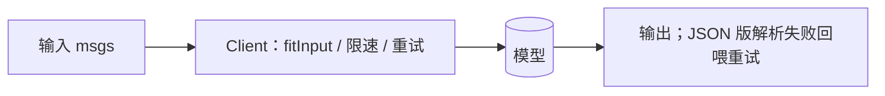
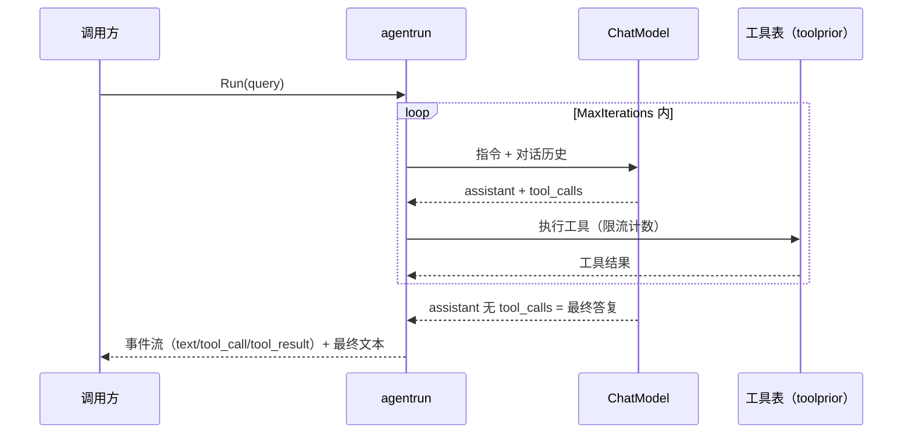
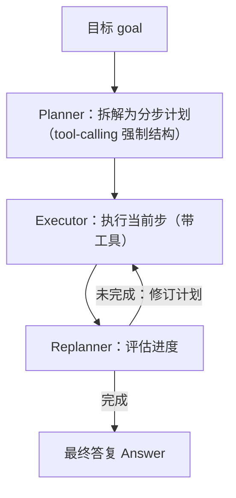
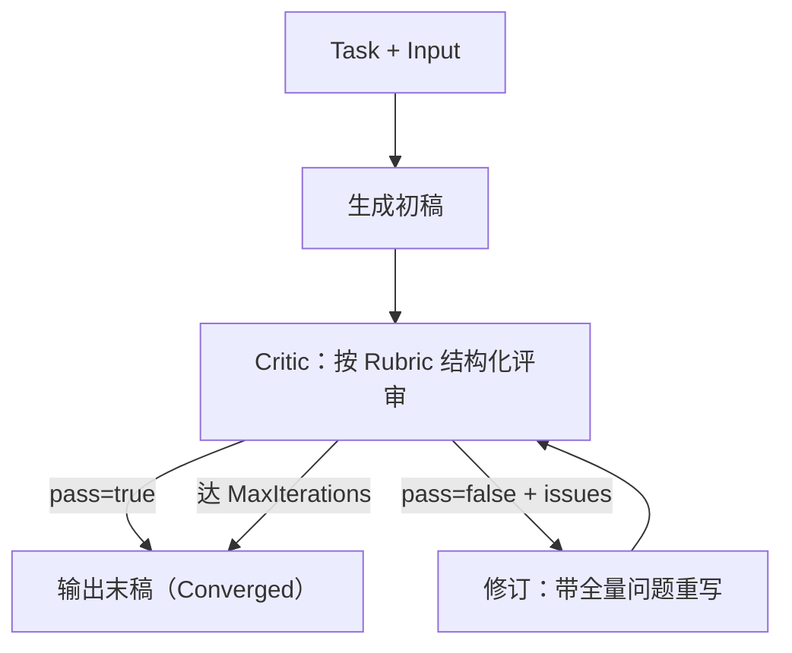
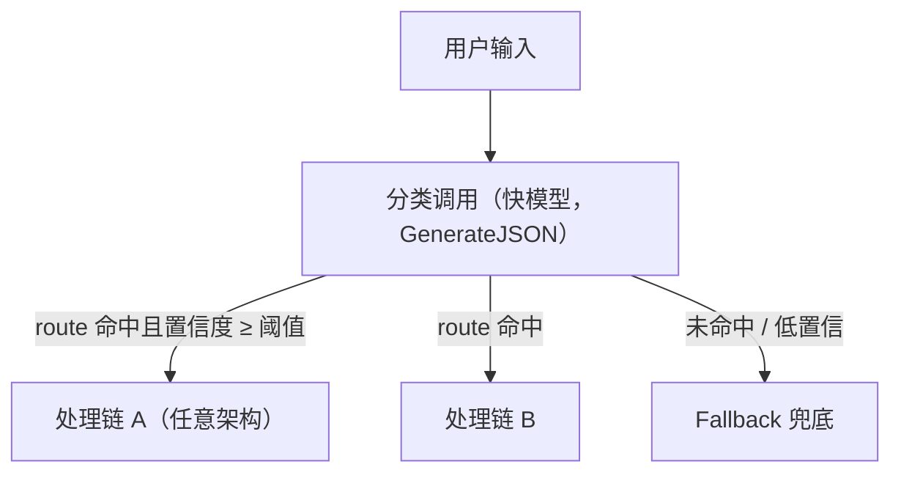
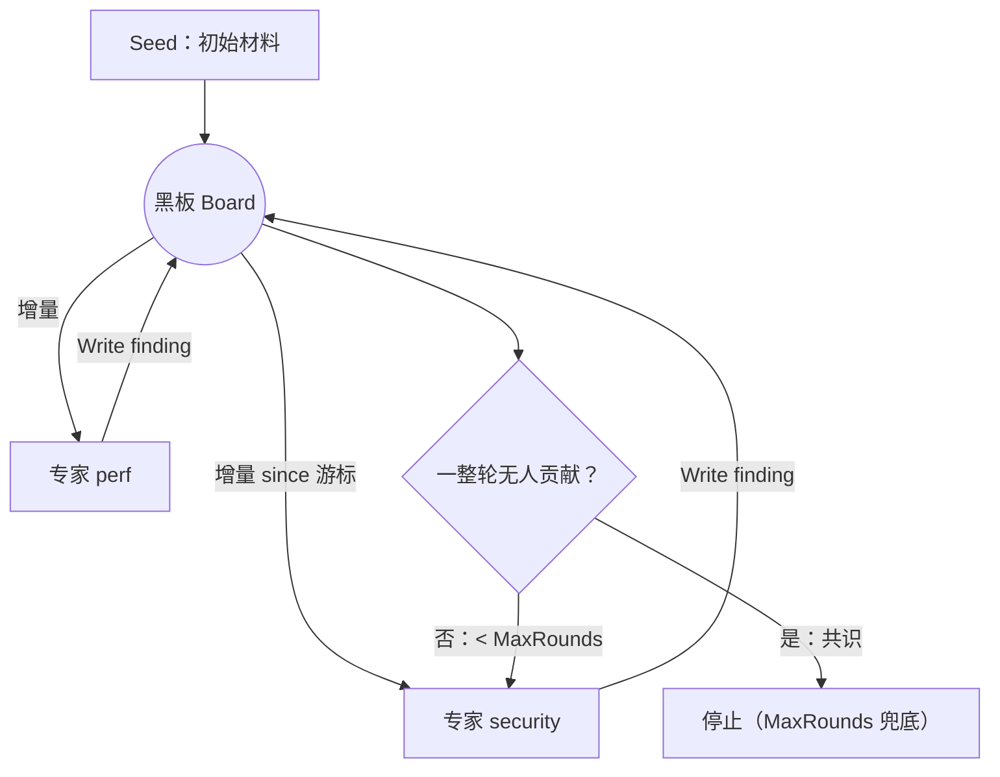
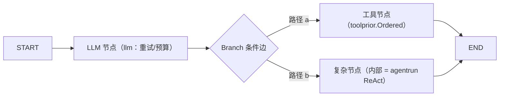

# Agent 架构模式支持矩阵

> 架构图使用 Mermaid；不支持渲染的查看端，代码块本身仍按文本可读。

七种常见 agent 架构在 agentkit（+ eino 底座）上的支持情况。原则：**编排原语不重复 eino**，
agentkit 提供的是"原语之上的样板与领域件"（降级链/工具纪律/限流/知识）。

## 选型决策流（按序自问）

```
1. 一次调用能完成吗？                     ── 能 → Single Agent（80% 的调用应止步于此）
2. 步骤可预知、可枚举吗？
   ├─ 可预知且 ≥4 步、需审计             ── → Plan-and-Execute
   └─ 不可预知、边做边看                 ── → ReAct（配 toolprior 限流）
3. 产出有可判定的硬质量标准吗？           ── 有 → 外面套 Reflection
4. 入口是多意图流量吗？
   ├─ 意图可枚举（≤10）                  ── → Router 显式路由
   └─ 意图由领域文档定义、量大且增长      ── → Skill 渐进披露（隐式路由）
5. 需要多专家协作吗？
   ├─ 彼此独立、无需互看                 ── → 并行 fan-out + 合并（Argus R4 模式）
   ├─ 有中心指派逻辑                     ── → eino adk Supervisor
   └─ 无中心、需互看触发                 ── → Blackboard
6. 流程结构已稳定且复杂（分支/并行/人工节点）？ ── → 固化成 Graph（eino compose）
```

**总原则：从最简单的架构开始，被现实逼着升级；不要从最复杂的开始，被复杂度困死。**

| # | 架构 | 支持状态 | 载体 |
|---|---|---|---|
| 1 | Single Agent | ✅ 一等支持 | `llm`（Generator/Resilient 降级链/预算/fitInput）+ `agentrun.Run` 单查询 |
| 2 | ReAct | ✅ 一等支持 | `agentrun`（ChatModelAgent + 事件流 + ToolsFactory + 重试样板）+ `toolprior` 三层工具约束 |
| 3 | Plan-and-Execute | ✅ v0.8.0 样板 | `agentrun.PlanAndExecute`（封装 eino adk prebuilt/planexecute 三件套） |
| 4 | Reflection | ✅ v0.8.0 原语 | `agentkit/reflection`（生成→批判→修订收敛循环） |
| 5 | Router+Skill | ✅ v0.8.0 原语 | `agentkit/router`（LLM 显式意图路由）+ `agentkit/skill`（渐进披露 skill 决策使用） |
| 6 | Blackboard | ✅ v0.8.0 原语 | `agentkit/blackboard`（共享黑板 + 专家轮转） |
| 7 | Graph Workflow | ✅ eino 原生 | `eino/compose`（Graph/Branch 条件边/并行）+ adk Sequential/Parallel/Loop/Supervisor |

---

## 1. Single Agent —— `llm`

无编排，一次调用。90% 的场景从这里开始；所有上层架构的节点最终都是一个 Single Agent。



**✅ 该用**
- 一次调用能完成：分类、抽取、改写、格式转换、单点问答、摘要
- 无外部事实依赖（不需要先查工具再回答）
- 延迟或成本敏感（一次调用的成本是 ReAct 的 1/N）
- 输出结构可一次定形（JSON schema 明确）

**❌ 不该用**
- 答案依赖模型看不到的事实（先检索/查工具再答 → ReAct）
- 需要多步推导且中间步可能失败需要重试/换路
- 输出需要迭代打磨且有可判定标准（→ Reflection）
- 用提示词硬塞超长上下文来规避工具调用——窗口爆了只会更糟

**⚠️ 陷阱**
- 最大的陷阱是"杀鸡用牛刀"：把一次调用的事拆成 agent 循环，成本和延迟 ×N，失败面 ×N

```go
client := llm.NewClient(chatModel, "deepseek-v4", budget)
client.ContextTokens = 1_000_000
msg, err := client.Generate(ctx, "stage", msgs)          // 带重试/限速/fitInput
err = client.GenerateJSON(ctx, "stage", msgs, &out)      // JSON 版（解析失败回喂）
```

需要多模型容灾时换 `llm.NewResilient`（降级链），接口不变（`llm.Generator`）。

## 2. ReAct —— `agentrun` + `toolprior`

边思考边调用工具的循环。**首选默认架构**——目标模糊、步骤不可预知时用它。



```go
out, err := agentrun.RunWithEvents(ctx, agentrun.Config{
    Name: "reviewer", Instruction: instruction,
    Model: chatModel,
    ToolsFactory: func() []tool.BaseTool { ... },  // 每次尝试重建（限流计数按尝试重置）
    MaxIterations: 12,
}, query, func(e agentrun.Event) { /* text|tool_call|tool_result */ })
```

工具表经 `toolprior` 组织：`StrategyPrompt`（提示词软约束）+ `Ordered`（排序注意力）
+ `LimitCalls`（硬限流，超限返回模型可见的 LIMIT_REACHED 文本软止损）。

**✅ 该用**
- 步骤不可预知：下一步做什么取决于上一步的工具结果
- 探索型任务：定位 bug 根因、在未知代码库里找证据
- 工具结果会改变计划（查了才发现要换个方向）

**❌ 不该用**
- 步骤固定可枚举（≥4 步且顺序确定）——写代码/Graph 编排更可控、更便宜、可测
- 单次调用能完成（见 Single Agent 的"杀鸡用牛刀"陷阱）
- 对延迟极敏感（每轮 = 一次 LLM 调用 + 工具执行，轮数不可预算）
- 工具不可靠或无边界：没有限流和迭代上限的 ReAct 是失控成本发生器

**⚠️ 陷阱**
- MaxIterations 必须显式设置（agentrun 默认 12）
- 外部/有副作用工具必须 `toolprior.LimitCalls`（且每次尝试重建工具表重置计数）
- 必须有降级出口：ReAct 失败落回单轮调用（Argus builtin/QA 均是此模式）

## 3. Plan-and-Execute —— `agentrun.PlanAndExecute`

计划先行：Planner 拆解目标为分步计划 → Executor 带工具逐步执行 → Replanner 评估进度
决定完成或修订计划，循环收敛。**目标明确、步骤可预规划的长链路任务**用它（区别于
ReAct 的边想边做）；每步执行结果可审计。



```go
res, err := agentrun.PlanAndExecute(ctx, agentrun.PlanExecuteConfig{
    Planner:  plannerModel,     // 须支持 tool calling（计划结构以 tool-calling 强制产出）
    Replanner: replannerModel, // 可选：完成判定模型（空 = 复用 Planner；v0.10.13 起支持）
    Executor: executorModel,
    Tools:    tools,
    MaxSteps: 10,
    PlannerInstruction: "只规划代码相关步骤",
}, "把模块 X 从框架 A 迁移到框架 B")
fmt.Println(res.Text)
```

需要定制 Replanner 提示词/输入整形时，直接用 eino `adk/prebuilt/planexecute` 原语。

**✅ 该用**
- 目标明确、可预规划为步骤清单，且步骤数多（≥4）或单步重（每步值得独立审计）
- 计划本身有价值：可人工评审/修改后再执行、可作为进度跟踪依据
- 步骤执行有可观测结果，Replanner 能据此判断"完成/修订"

**❌ 不该用**
- 目标本身模糊——先规划只会把误解固化成计划（先 ReAct 探索清楚再定）
- 步骤少（≤3）或轻（单轮可完成）：规划开销占比过高
- 环境每步剧变：计划频繁作废，Replan 循环烧钱不收敛

**⚠️ 陷阱**
- 计划质量 = Planner 模型质量，弱模型规划强模型执行是常见错配
- Replanner 判定"完成"必须可靠，否则提前交差或永不收敛（MaxSteps 兜底必设）
- 步骤粒度以"单步可独立验证"为标准：太粗执行器做不动，太细计划膨胀

## 4. Reflection —— `agentkit/reflection`

生成 → 按 Rubric 自我批判（结构化 pass/issues）→ 带全量问题修订 → 收敛或达轮次上限。


**产出质量有可判定的硬标准**时用它；标准主观或需外部事实核验的场景 Critic 不可靠，
不要用。

```go
res, err := reflection.Refine(ctx, &reflection.Config{
    Model: chatModel, ModelName: "deepseek-v4",
    Task:  "实现该需求的 Go 函数",
    Input: requirementText,
    Rubric: "1. 处理了空切片 2. 无 data race 3. 有表驱动测试",
    MaxIterations: 3,
})
fmt.Println(res.Text, res.Converged, len(res.Rounds)) // Rounds 含每稿与批判留痕
```

**✅ 该用**
- 存在可判定的硬标准：能编译/通过测试/逐条核对清单/字数格式约束
- 单稿质量不稳定、且失败模式可枚举进 Rubric（历史评审数据的常见问题清单）
- 产出重要到值得 2~3 倍调用成本去打磨（对外交付物、安全相关代码）

**❌ 不该用**
- 标准主观（"写得够好""有深度"）——Critic 自评不可信，收敛 ≠ 正确
- 需要外部事实核验（Critic 没有工具/数据，"通过"是幻觉）
- 成本/延迟敏感，或第一稿稳定达标（先跑数据再决定要不要 Reflection）
- Generator 和 Critic 用同一模型且该模型有系统性盲区——重要场景 Critic 换不同家族模型

**⚠️ 陷阱**
- Rubric 写不进具体条目就别用 Reflection：reflection 的全部价值在 Rubric 质量
- 收敛只说明"符合自评标准"，不是"正确"——外部验收仍然需要
- pass=true 却带 issues 的不自洽评审判不通过（包内已防御），但 Rubric 歧义仍会
  导致循环震荡——MaxIterations 是唯一安全带

## 5. Router + Skill —— `agentkit/router` + `agentkit/skill`

两层含义互补：



- **显式路由**（`router`）：入口流量可枚举为有限意图时，先用一次廉价分类调用选路，
  再分发到对应处理链（各链可以是任意架构——ReAct/P&E/单轮）。

  ```go
  r, _ := router.New(&router.Config{
      Model: fastModel, // 分类用快模型即可
      Routes: []router.Route{
          {Name: "bug-fix", Description: "修代码类请求", Handle: fixChain},
          {Name: "explain", Description: "解释类请求", Handle: explainChain},
      },
      MinConfidence: 0.6,
      Fallback: func(ctx context.Context, input, reason string) (string, error) { ... },
  })
  d, out, _ := r.Run(ctx, userInput) // d.Route/d.Confidence/d.Reason 可观测
  ```

- **隐式路由**（`skill`）：类别多到枚举不动/由领域文档定义时，不做前置分类——把 skill
  清单注入提示词，agent 按任务相关性自主 `use_skill` 按需加载全文（渐进披露）。

  ```go
  metas, _ := provider.ListSkills(ctx)
  instruction += skill.ListPrompt(metas)   // 清单进提示词
  useSkill, _ := skill.AsSkillTool(provider, nil) // use_skill 工具进工具表
  ```

**✅ 该用（router）**
- 入口意图可枚举为有限类别（经验值 ≤10），各类别处理链差异大（不同工具/模型/流程）
- 想按类别配不同成本档（简单类别走快模型，复杂类别走 ReAct/P&E）
- 分类错误可被 Fallback 或人工纠正兜住

**✅ 该用（skill）**
- 类别数量大、持续增长、由领域文档承载（规范/方法论/SOP）——枚举路由表跟不上变化
- 路由决策需要"看了任务全文再定"——渐进披露让 agent 自主判断

**❌ 不该用（两者通例）**
- 类别间处理链相同或高度重叠——路由没有收益，白付一次分类调用
- 类别 <3 或边界模糊（分类错误率会吃掉全部收益）
- skill 文档质量差/互相重叠——隐式路由的质量上限 = 文档质量

**⚠️ 陷阱**
- router：MinConfidence + Fallback 必配；类别超 10 个考虑两级路由（先粗类再细类）
- skill：description 是路由依据，写不清 = 永不被选中
- 组合形态：router 粗分到域，域内 skill 细分

## 6. Blackboard —— `agentkit/blackboard`

共享黑板 + 多专家轮转读写，无中心调度员（区别于 eino adk `prebuilt/supervisor` 的
中心指派）。每位专家观察黑板增量、判断与己相关则贡献；一轮无人补充（共识）或达
轮次上限停止。**多视角分析、贡献顺序不可预知**的场景。



```go
board := blackboard.NewBoard()
board.Seed("material", diffText)
res, _ := blackboard.Convene(ctx, board, []blackboard.Specialist{
    {Name: "security", Act: func(ctx context.Context, b *blackboard.Board, since int64) (bool, error) {
        for _, e := range b.EntriesAfter(since) { /* 观察增量 */ }
        b.Write("security", "finding", "SQL 注入风险")
        return true, nil
    }},
    {Name: "perf", Act: ...},
}, &blackboard.ConveneOptions{MaxRounds: 3})
fmt.Println(res.Rounds, len(board.Entries()))
```

专家内部可以用任何架构实现（常见：每位专家内部是一个 ReAct）。

**✅ 该用**
- 多视角分析同一材料，且视角间要互看：后位专家的判断依赖前位专家的贡献
- 贡献顺序不可预知、无中心指派逻辑（谁能贡献多少取决于材料内容）
- 需要共识收敛信号（"一整轮无人补充"即分析饱和）

**❌ 不该用**
- 有明确的指派逻辑/流程（→ eino adk Supervisor：中心调度员可控可观测）
- 专家彼此独立、无需互看（→ 并行 fan-out + 合并，更快更便宜——Argus R4 多插件
  并行即此形态，互看诉求由 Merger 分歧标注补足）
- 强顺序依赖、固定流程（→ Sequential/graph 编排）
- 对输出结构有硬要求（黑板条目自由生长，结构化需专家内自行保证）

**⚠️ 陷阱**
- 无中心调度 = 无法保证覆盖度：某视角没人认领就漏了——专家职责要互斥且完备
- 话痨专家会跑满 MaxRounds（每轮都写 = 永不共识）——专家要有"写过即沉默"约束
- 黑板是内存态：需持久化/回放时由调用方对 Entries 快照落库

## 7. Graph Workflow —— eino `compose` + adk workflow

**agentkit 不重复编排原语**——图编排直接用 eino 底座，agentkit 的包（llm/agentrun/
toolprior/reflection/...）作为图上的节点构件：



- `compose.NewGraph[I, O]` + `AddChatModelNode/AddToolNode/AddLambdaNode` +
  `NewGraphBranch`（条件边）/并行分支——DAG/状态图/循环图；
- `adk.NewSequentialAgent / NewParallelAgent / NewLoopAgent`——顺序/并行/循环的
  agent 级 workflow（`LoopAgent` 配 `NewBreakLoopAction` 可提前退出）；
- `adk/prebuilt/supervisor`——中心调度员的多 agent 协作（与 blackboard 的无中心
  形态互补，按"是否有明确指派逻辑"选择）。

组合示例：图的每个 LLM 节点用 `llm`（重试/预算），工具节点用 `toolprior.Ordered`
产物，单个复杂节点内部是 `agentrun` ReAct——**节点内用 agentkit 样板，节点间用
eino 编排**。

**✅ 该用**
- 流程结构稳定且复杂：条件分支/并行汇聚/循环重试/人工审批节点
- 需要确定性保证与全链路可追溯（合规场景：每步输入输出可回放）
- 流程已被简单架构验证过、要固化成产品级管线

**❌ 不该用**
- 流程还在探索期、经常变——改图成本高于改 prompt（先 Single/ReAct 跑通，稳定后
  再固化成图，这是图的正确定位）
- 节点逻辑简单到几个 if 就能表达
- 需要 LLM 自主决策路径且路径空间大——图的分支是写死的，决策空间大用 ReAct

**⚠️ 陷阱**
- 把需要语义判断的地方写成确定性条件边（判断条件本身该是个 LLM 节点）
- 节点粒度：一个节点一件事 + 明确输入输出契约；巨型节点等于把复杂度藏进节点内
- 错误传播：定义好节点失败时的路由（跳过/重试/终止），不要让第一个错误毒化全图

---

## 选型速查

| 场景特征 | 用什么 |
|---|---|
| 一次调用能解决 | `llm` Single Agent |
| 步骤不可预知，边做边看 | ReAct（`agentrun`） |
| 步骤可预规划、需可审计 | Plan-and-Execute（`agentrun.PlanAndExecute`） |
| 有硬质量标准，可自评 | Reflection（`reflection.Refine`） |
| 意图可枚举、处理链差异大 | Router（`router.Run`） |
| 意图由领域文档定义、数量大 | Skill 渐进披露（`skill.AsSkillTool`） |
| 多视角无中心协作 | Blackboard（`blackboard.Convene`） |
| 有中心指派的多 agent | Supervisor（eino adk prebuilt） |
| 复杂流程/条件分支/并行 | Graph（eino compose / adk workflow） |
